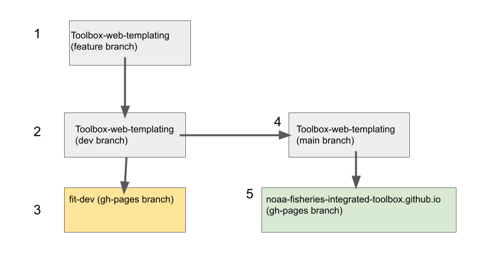

# Guide to the Toolbox Templating repo

## Big picture, GitHub Branching



1. Try out new changes in a feature branch off of dev.
2. Merge changes into dev. Once merged in, use a github action to build the html pages and deploy them to 3.
3. The fit-dev repo is hosted on github pages. Navigate to noaa-fisheries-integrated-toolbox.github.io/fit-dev to preview the FIT website.
4. Once confirming the dev pages look good, merge changes into 4 (for small changes, can consider squashing or rebasing instead). Once merged in, use a github action (done automatically) to build the html pages and deploy them to 5. Delete the dev branch and recreate it from (so that they are back in sync with the exact same commits).
5. This is the production version of the NOAA fisheries site, advertised to the public.

## Webpage addresses on production

 - FIT landing page (https://noaa-fisheries-integrated-toolbox.github.io/ ; no change)
 - individual tool landing pages, toolbox hosted (https://noaa-fisheries-integrated-toolbox.github.io/ASAP, for example; CHANGE from nmfs-fish-tools.github.io/ASAP)

## redirect pages
 - will need the nmfs-fish-tools.github.io (and other org .io repos) to redirect; same with nmfs-fish-tools.github.io/toolname. These redirect automatically or have a redirect link.

## Org Templating

This repository includes templates and JSON data for the FIT. [python's jinja 2](https://zetcode.com/python/jinja/) is used to generate webpages from the html templates and JSON files (For R users, this approach is similar to using [glue](https://glue.tidyverse.org/)).

### How to update or add tool landing pages 
1. In [model_list_dir subfolder](https://github.com/noaa-fisheries-integrated-toolbox/toolbox_web_templating/tree/main/model_list_dir) add or update `.json` files. Examples of json are available in the readme. If onboarding a new tool, the issue from [the onboard-and-update repo](https://github.com/noaa-fisheries-integrated-toolbox/onboard-and-update) should have a json based on user input that can be copy/pasted in, then checked.
2. If it is a new tool, add the name of the json file (minus the extension, case sensitive) to the list_of_models item in the models_all.json file.
3. Changes can be checked locally using instructions in the "Creating Webpages Locally From Templates"
4. After committing and pushing to dev, changes can be checked on the [fit-dev](https://noaa-fisheries-integrated-toolbox.github.io/fit-dev/) site. If GitHub actions are failing, look at them and make changes.
5. Once actions passing, share changed dev tool landing page with the person submitting the(e.g., if the tool is called, my-tool, the address would be https://noaa-fisheries-integrated-toolbox.github.io/fit-dev/my-tool). Allow them to request changes. 
6. If the author approves, open an PR to main, which KD will look at and merge in if passing checks.

## Explanation of JSON metadata
JSON data can be validated using [schema](https://json-schema.org/understanding-json-schema/about.html)
```json
{
  "active_development": true,     //in active development? true or false
  "noaa_internal": false, //Maintained by NOAA? true or false.
  "associated_tools": [
    {"name":"NAME OF TOOL","link":"LINK TO TOOL"},
    {"name":"NAME OF TOOL","link":"LINK TO TOOL"}
  ],
  "authors": "First1 Last1 and First2 Last2",// **Name of the tool author or authors
  "background_text": "Information on this tool goes here and will be displayed on the tool page", //** Please Write up to a paragraph.
  "maintainer_email": "fisheries.toolbox@noaa.gov", //**Email for main contact. Please put a noaa.gov email address that someone will check.
  //Note: At least one of the 5 following links need to be filled out for your tool to be found. Please fill in as many as apply.
  "online_app_link": "https://some.link.noaa.gov", //IF THERE IS A SHINY APP OR OTHER ONLINE APP, PUT LINK HERE OTHERWISE leave out this element.
  "executable_link": "https://some.link.noaa.gov", //**LINK TO DOWNLOAD APPLICATION IF EXE exists. Leave out this element if exe does not exist
  "website_link": "https://some.link.noaa.gov", //**link to the website, if it exists; otherwise, leave out.
  "documentation_link": "https://some.link.noaa.gov", //**LINK TO EXTERNAL DOCUMENTATION. Leave element out if does not exist or link is already entered elsewhere (e.g., on the website)
  "source_code_link": "https://github.com/org/repo", //LINK TO GITHUB CODE REPO, if exists.
  "citation": "https://doi.org/10.32614/RJ-2012-002", //How to cite the package. Ideally an article with DOI.
  "tool_abbreviation": "MODABBREV", //SHORT ABBREVIATION OF TOOL USED AT TOP OF TILE ON LANDING PAGE. Must Match the name of the JSON file. Required.
  "tool_name": "Complete Name of Model Tool", //required
  "pdf_download_link": "https://somelink.org/my.pdf", //Not used, and plan to deprecate
  "release_badge":"NMFS-ecosystem-tools/MSCAA"//IF THE REPO UESE RELEASES ON GITHUB, JUST PUT THE ORG/REPO HERE TO LINK.
  "references": ["ref1", "ref2"], //** Formatted publication references.Please include DOI if available.
  "software_badges":[
      { "link":"https://www.repostatus.org/badges/latest/active.svg",
      "alt_text": "A software badge showing that the repository is active"
      },
      {
        "link": "https://img.shields.io/badge/platform-linux%20%7Cwin-lightgrey", 
        "alt_text":"A software badge showing that the software can be used on Linux or Windows Platforms"
      }
  ],
  "static_version_number": "1.0.0",//** add version number only if it is not using github releases and the version is unlikely to change. Omit this element if not used.
  "toolbox_drawers": ["Fish and Fisheries", "General Modeling Tools"], //** options are: "Fish and Fisheries", "Ecosystem"", "Human Dimensions", "Protected Species", "General Modeling Tools", and "Utility Tools"*. Put all that apply to the tool.
  "keywords": ["Economics", "R", "Web App"], //**keywords to sort through tools.,
  "user_organizations": ["SEFSC", "NWFSC", "SWFSC"] //operational users of the tool
```

## Creating Webpages Locally From Templates

Python and its libraries `Jinja2` and `requests` need to be installed locally.
```
pip install jinja2
pip install requests
```

From bash, run:

```
python create_tool_landing_page.py dev_config.json
python create_catalog_landing_page.py dev_config.json # or prod_config.json if building the production site.
python create_site_index_page.py dev_config.json # or prod_config.json if building the production site.
```

These are just the commands in `create_html`.yml. Note that this will create new webpages that should NOT be saved to the repository.

To view the webpages from VS code, try using the Live Preview Extension.
You may need to add .html to the end of a link in order to view it properly. Sometimes the 
embedded preview doesn't work, so a separate browser window will need to be opened instead.

## Overview of GitHub Actions in toolbox_web_templating

GitHub actions code (YAML files) live in the `.github/workflows` directory.

- `create_html.yml`: creates the html pages for viewing and saves them as artifacts. The files can be downloaded and examined. Runs on every push to any branch and manually.
- `dev_create_website_and_deploy.yml`: updates [FIT dev site](https://github.com/noaa-fisheries-integrated-toolbox/fit-dev) by deploying rendered html from the toolbox_web_templating dev branch to https://github.com/noaa-fisheries-integrated-toolbox/fit-dev/tree/gh-pages (gh-pages branch). Runs on every push to the dev branch and manually.
- `prod_create_website_and_deploy.yml`: updates [FIT prod site](https://noaa-fisheries-integrated-toolbox.github.io/) by deploying rendered html from the toolbox_web_templating main branch to https://github.com/noaa-fisheries-integrated-toolbox/noaa-fisheries-integrated-toolbox.github.io/tree/gh-pages (gh-pages branch). runs on every push to main and manually.
- `validate_json_config.yml`: check that `prod_config.json`,`dev_config.json` matches the JSON schema defined in `schema_config.json` and that `models_all.json` matches the JSON schema definied in `schema_models_all.json`. If the GitHub action fails, it will provide info on how the json files need to be modified to match the schema. Runs on every push to any branch, and manually.
- `validate_json_model_list.yml`: checks that the JSON files in `model_list_dir` matches the JSON schema defined in `schema_model_list.json`. If the GitHub action fails, it will provide info on how the json files need to be modified to match the schema. Runs on every push to any branch where there are changes to the files in `model_list_dir` and manually.


## Disclaimer

“The United States Department of Commerce (DOC) GitHub project code is provided on an ‘as is’ basis and the user assumes responsibility for its use. DOC has relinquished control of the information and no longer has responsibility to protect the integrity, confidentiality, or availability of the information. Any claims against the Department of Commerce stemming from the use of its GitHub project will be governed by all applicable Federal law. Any reference to specific commercial products, processes, or services by service mark, trademark, manufacturer, or otherwise, does not constitute or imply their endorsement, recommendation or favoring by the Department of Commerce. The Department of Commerce seal and logo, or the seal and logo of a DOC bureau, shall not be used in any manner to imply endorsement of any commercial product or activity by DOC or the United States Government.”
